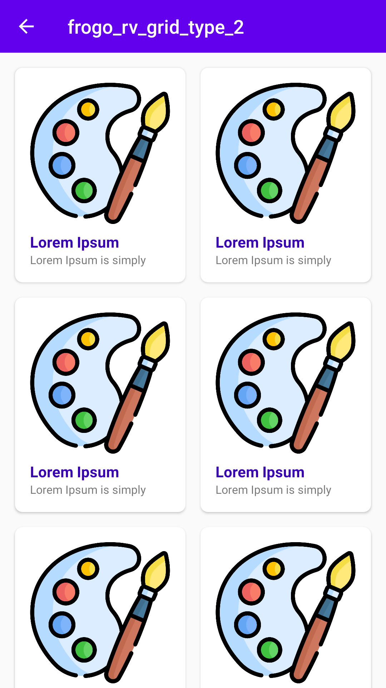

## About This Project
[](https://jitpack.io/#frogobox/frogo-android-ui-kit)
[](https://github.com/frogobox/frogo-android-ui-kit/actions/workflows/detekt-analysis.yml)
[](https://github.com/frogobox/frogo-android-ui-kit/actions/workflows/generate-apk-aab.yml)

- Follow-up project from [frogo-ui-kit](https://github.com/amirisback/frogo-ui-kit)
- UI Kit for helping you in apps development

## Migrate from frogo-ui-kit
- Just renaming package
- com.frogobox.frogodesignkit >> com.frogobox.uikit

## Screen Shoot
| UI KIT LIST |  UI KIT GRID              |
|:------------------:|:----------------------------:|
| |  |


## Version Release
This Is Latest Release

    $version_release = 1.0.5

What's New??

    * Update Build Gradle Latest Version *
    * Jetpack Compose Support *
    * build.gradle.kts / Kotlin DSL *

## Download this project

### Step 1. Add the JitPack repository to your build file (build.gradle : Project)

#### <Option 1> Groovy Gradle

    // Add it in your root build.gradle at the end of repositories:

    allprojects {
        repositories {
            ...
            maven { url 'https://jitpack.io' }
        }
    }

#### <Option 2> Kotlin DSL Gradle

```kotlin
// Add it in your root build.gradle.kts at the end of repositories:

allprojects {
    repositories {
        ...
        maven { url = uri("https://jitpack.io") }
    }
}
```
      
### Step 2. Add the dependency (build.gradle : Module)

#### <Option 1> Groovy Gradle

    dependencies {
        // library frogo-android-ui-kit
        implementation 'com.github.frogobox:frogo-android-ui-kit:1.0.5'
    }

#### <Option 2> Kotlin DSL Gradle

    dependencies {
        // library frogo-android-ui-kit
        implementation("com.github.frogobox:frogo-android-ui-kit:1.0.5")
    }

## Documentation
- Layouts
    - RecyclerView List [Click Here](https://github.com/frogobox/frogo-android-ui-kit/blob/master/docs/recyclerview_list.md)
    - RecyclerView Grid [Click Here](https://github.com/frogobox/frogo-android-ui-kit/blob/master/docs/recyclerview_grid.md)
- Drawables [Click Here](https://github.com/amirisback/frogo-ui-kit/wiki/Drawable)
- Dimens [Click Here](https://github.com/amirisback/frogo-ui-kit/wiki/Dimens)
- Colors [Click Here](https://github.com/amirisback/frogo-ui-kit/wiki/Colors)
- Strings [Click Here](https://github.com/amirisback/frogo-ui-kit/wiki/Strings)
- Styles [Click Here](https://github.com/amirisback/frogo-ui-kit/wiki/Styles)


## Colaborator
Very open to anyone, I'll write your name under this, please contribute by sending an email to me

- Mail To faisalamircs@gmail.com
- Subject : Github _ [Github-Username-Account] _ [Language] _ [Repository-Name]
- Example : Github_amirisback_kotlin_admob-helper-implementation

Name Of Contribute
- Muhammad Faisal Amir
- Waiting List
- Waiting List

Waiting for your contribute

## Attention !!!
- Please enjoy and don't forget fork and give a star
- Don't Forget Follow My Github Account


